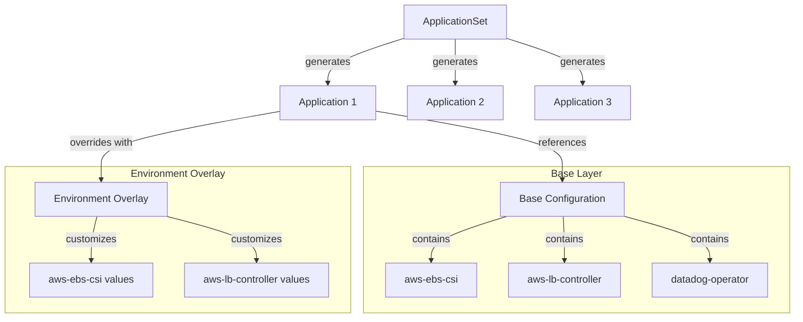
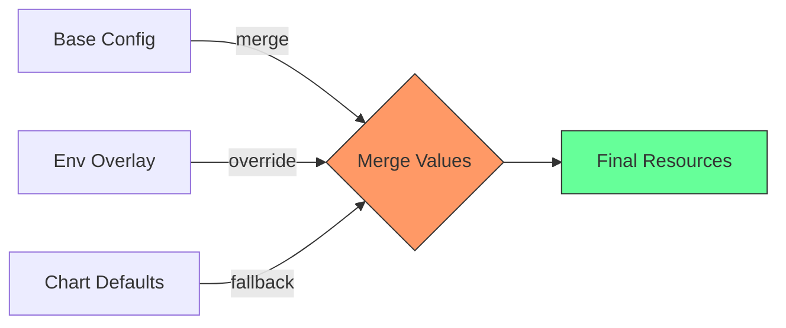
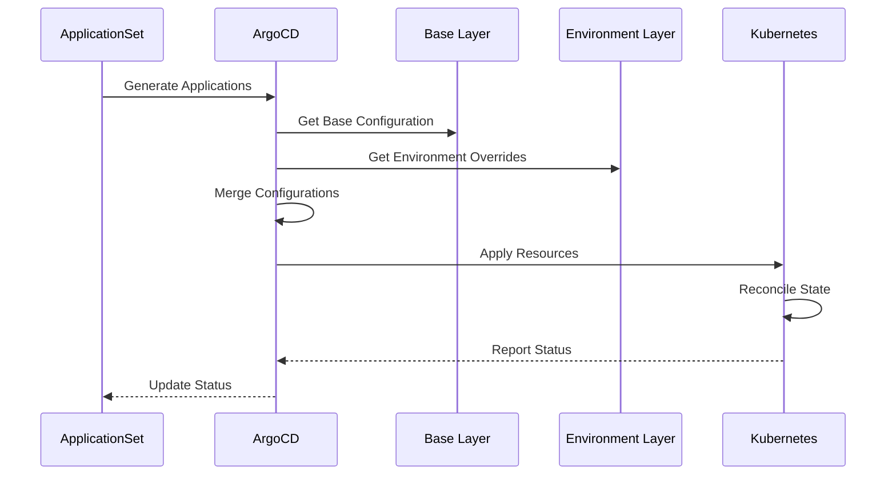
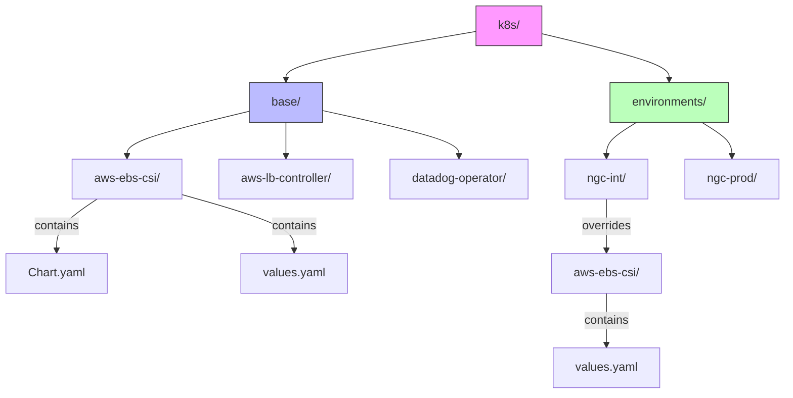

# ArgoCD ApplicationSet Structure

```ascii
k8s/
├── base/                         # Base infrastructure components
│   ├── aws-ebs-csi/              # Each component has its own directory
│   │   ├── Chart.yaml            # Helm chart definition
│   │   └── values.yaml           # Default base values
│   ├── aws-lb-controller/
│   ├── datadog-operator/
│   └── ...
│
├── ngc-int/                      # Environment overlay
│   └── infra/                    # Namespace-specific configs
│       ├── aws-ebs-csi/          # Environment-specific overrides
│       │   └── values.yaml       # Values that override base
│       └── ...
│
└── other-environments/           # Other environment overlays
    └── ...

             ⬇️ ArgoCD ApplicationSet Flow ⬇️

┌────────────────────────────────────────────────────┐
│ ApplicationSet (Helm)                              │
│                                                    │
│ 1. Defines template for multiple Applications      │
│ 2. Uses generators to create Applications          │
│ 3. Manages multiple clusters/environments          │
└────────────────────────────────────────────────────┘
                    │
                    ├─────────────────┐
                    │                 │
┌───────────────── ─▼────┐  ┌─────────▼──────────────┐
│ Base Configuration     │  │ Environment Overlay    │
│                        │  │                        │
│ - Default values       │  │ - Environment specific │
│ - Core components      │  │ - Overrides base       │
│ - Shared settings      │  │ - Additional configs   │
└────────────────────────┘  └────────────────────────┘

How it works:
1. ApplicationSet template defines how to deploy components
2. Base contains default configurations
3. Environment overlays customize the base configs
4. Helm merges base + overlay values
5. ArgoCD ensures desired state matches actual state
```

## Key Concepts

1. **Base Layer (`/base`)**

   - Contains foundational Helm charts
   - Defines default configurations
   - Reusable across environments

2. **Environment Overlays**

   - Environment-specific configurations
   - Override base values when needed
   - Organized by namespace

3. **ApplicationSet**

   - Templates multiple ArgoCD Applications
   - Uses generators for different environments
   - Maintains consistent structure across clusters

4. **Value Precedence**
   ```
   Environment Values > Base Values > Chart Defaults
   ```

## Example Flow

1. ApplicationSet sees a new environment needs deployment
2. Creates Application from template
3. Combines base + environment values
4. ArgoCD syncs the resulting configuration
5. Kubernetes applies the changes

This structure enables:

- Consistent deployments across environments
- Environment-specific customization
- Single source of truth for configurations
- GitOps-based management

## Component Relationship



## Value Merge Process



## Deployment Flow



## Directory Structure


